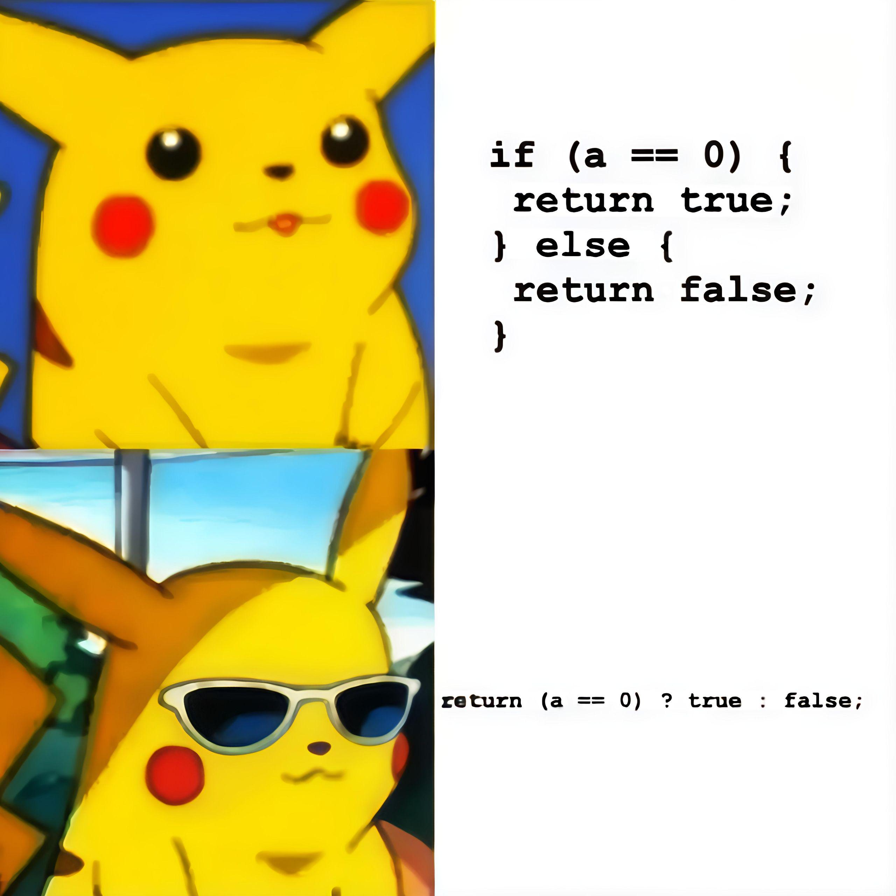

---

> The virgin 6-line if-else statement vs the chad one-liner ternary operator. Nothing says "I'm a coding sophisticate" like condensing a perfectly readable conditional into a cryptic single line that makes future maintainers question their career choices. The sunglasses really sell it - "Look at me, I just saved 5 whole lines and only sacrificed the entire team's sanity." Next up: replacing all your variable names with single letters to achieve true programming enlightenment.

> Image and text source:  https://programmerhumor.io/programming-memes/the-virgin-if-else-vs-the-chad-ternary-operator-crt7

## Personal Note

I *myself* have returned (a === 0), *and still do when I'm in a rush*.

## Reflection

All Core Counter functionality and Advanced Features (History Tracking, Auto-Save, Keyboard Listeners, Reset Mechanism) are implemented.

I used loads of console.log during the process.  Removed them all.  I think I'll leave them in next time, so I can do a mass 'find and replace' if I ever want to.  Typically my console.log these days look like (\`hSD invoked with count: ${count}, arrayOfCount: ${arrayOfCount}\`).

## References

https://medium.com/@glasshost/check-if-an-element-is-focused-in-react-4b66eb4241cb
https://react.dev/reference/react/useRef
https://developer.mozilla.org/en-US/docs/Web/API/Element/focus_event
https://stackoverflow.com/questions/30619285/detect-whether-input-element-is-focused-within-reactjs
https://developer.mozilla.org/en-US/docs/Web/API/Element/keydown_event
https://developer.mozilla.org/en-US/docs/Web/API/UI_Events/Keyboard_event_code_values
https://stackoverflow.com/questions/47933175/adding-event-listener-for-keydown-to-react-element
https://react.dev/reference/react/useEffect
https://react.dev/reference/react/useCallback
https://developer.mozilla.org/en-US/docs/Web/API/Window/setTimeout
https://kentcdodds.com/blog/get-a-catch-block-error-message-with-typescript
https://www.geeksforgeeks.org/reactjs/fetching-data-from-an-api-with-useeffect-and-usestate-hook/

